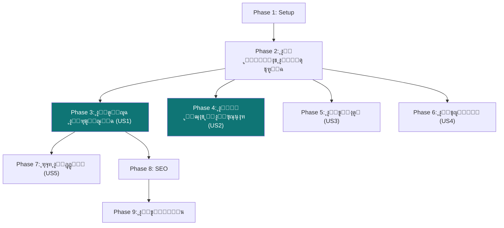

# Tasks: ู…ูˆู‚ุน ูุงุฑุงู…ุงุณ ุงู„ุชุนุฑูŠููŠ ุงู„ุงุญุชุฑุงููŠ (Landing Website)

**Feature**: `009-landing-website`
**Spec**: [spec.md](file:///d:/Programming/Faramace/specs/009-landing-website/spec.md)
**Created**: 2026-03-11

---

## Phase 1: Setup โ€” ุฅุนุฏุงุฏ ุจู†ูŠุฉ ุงู„ู…ุดุฑูˆุน

> **Goal**: ุชุฌู‡ูŠุฒ ู…ู„ูุงุช ูˆู‡ูŠูƒู„ูŠุฉ ุงู„ุตูุญุงุช ูƒู…ุดุฑูˆุน Next.js ู…ู†ูุตู„ ููŠ `apps/landing`

- [ ] T001 ุฅุนุฏุงุฏ ู…ู„ูุงุช ุงู„ู…ุดุฑูˆุน ุงู„ุฃุณุงุณูŠุฉ `package.json`, `tailwind.config.ts`, `tsconfig.json` ููŠ ู…ุฌู„ุฏ `apps/landing` ูˆุฅู†ุดุงุก ู…ู„ู `layout.tsx` ุงู„ุฃุณุงุณูŠ
- [ ] T002 [P] ุฅู†ุดุงุก ู…ู„ู ุงู„ุชุตู…ูŠู… ุงู„ุฃุณุงุณูŠ `apps/landing/app/globals.css` ู…ุน ู…ุชุบูŠุฑุงุช CSS (ุฃู„ูˆุงู†ุŒ ุฎุทูˆุทุŒ ุชุฏุฑุฌุงุช) ูˆุงู„ู€ Design Tokens
- [ ] T003 [P] ุฅู†ุดุงุก ู…ูƒูˆู† `apps/landing/components/navbar.tsx` โ€” ุดุฑูŠุท ุงู„ุชู†ู‚ู„ ุงู„ุนู„ูˆูŠ ุงู„ุซุงุจุช (ุงู„ุดุนุงุฑ + ุฑูˆุงุจุท ุงู„ุชู†ู‚ู„ + ุฒุฑ ุชุณุฌูŠู„ ุงู„ุฏุฎูˆู„) ู…ุน ุชุฃุซูŠุฑ ุงู„ุดูุงููŠุฉ ุนู†ุฏ ุงู„ุชู…ุฑูŠุฑ
- [ ] T004 [P] ุฅู†ุดุงุก ู…ูƒูˆู† `apps/landing/components/footer.tsx` โ€” ุงู„ุชุฐูŠูŠู„ (ุฑูˆุงุจุท ุณุฑูŠุนุฉ + ุชูˆุงุตู„ ุงุฌุชู…ุงุนูŠ + ุญู‚ูˆู‚ ุงู„ู†ุดุฑ)
- [ ] T005 [P] ุฅู†ุดุงุก ู…ูƒูˆู† `apps/landing/components/whatsapp-button.tsx` โ€” ุฒุฑ ูˆุงุชุณุงุจ ุงู„ุนุงุฆู… ููŠ ุฌู…ูŠุน ุงู„ุตูุญุงุช
- [ ] T006 ุฅุถุงูุฉ ุฎุท Cairo/IBM Plex Arabic ู…ู† Google Fonts ููŠ `apps/landing/app/layout.tsx` ูˆุถุจุท RTL ูˆุงุชุฌุงู‡ ุงู„ูƒุชุงุจุฉ

---

## Phase 2: Foundational โ€” ุงู„ู…ูƒูˆู†ุงุช ุงู„ู…ุดุชุฑูƒุฉ

> **Goal**: ุจู†ุงุก ุงู„ู…ูƒูˆู†ุงุช ุงู„ู‚ุงุจู„ุฉ ู„ุฅุนุงุฏุฉ ุงู„ุงุณุชุฎุฏุงู… ููŠ ุฌู…ูŠุน ุงู„ุตูุญุงุช

- [ ] T007 ุฅู†ุดุงุก ู…ูƒูˆู† `apps/landing/components/section-heading.tsx` โ€” ุนู†ูˆุงู† ุงู„ุฃู‚ุณุงู… ุงู„ู…ูˆุญุฏ (ุนู†ูˆุงู† + ูˆุตู ูุฑุนูŠ + ุฎุท ุชุฒูŠูŠู†ูŠ)
- [ ] T008 [P] ุฅู†ุดุงุก ู…ูƒูˆู† `apps/landing/components/feature-card.tsx` โ€” ุจุทุงู‚ุฉ ุงู„ู…ูŠุฒุฉ (ุฃูŠู‚ูˆู†ุฉ + ุนู†ูˆุงู† + ูˆุตู) ู…ุน ุชุฃุซูŠุฑ hover
- [ ] T009 [P] ุฅู†ุดุงุก ู…ูƒูˆู† `apps/landing/components/pricing-card.tsx` โ€” ุจุทุงู‚ุฉ ุฎุทุฉ ุงู„ุงุดุชุฑุงูƒ (ุงุณู… + ุณุนุฑ + ู…ู…ูŠุฒุงุช + ุฒุฑ CTA) ู…ุน ุชู…ูŠูŠุฒ ุงู„ุฎุทุฉ ุงู„ุฃูุถู„
- [ ] T010 [P] ุฅู†ุดุงุก ู…ูƒูˆู† `apps/landing/components/testimonial-card.tsx` โ€” ุจุทุงู‚ุฉ ุดู‡ุงุฏุฉ ุงู„ุนู…ูŠู„ (ุตูˆุฑุฉ + ุงุณู… + ุงู‚ุชุจุงุณ + ุงุณู… ุงู„ุตูŠุฏู„ูŠุฉ)
- [ ] T011 [P] ุฅู†ุดุงุก ู…ูƒูˆู† `apps/landing/components/counter-animation.tsx` โ€” ุฑู‚ู… ู…ุชุญุฑูƒ (Count-up animation) ู„ู„ุฅุญุตุงุฆูŠุงุช
- [ ] T012 [P] ุฅู†ุดุงุก ู…ูƒูˆู† `apps/landing/components/cta-button.tsx` โ€” ุฒุฑ CTA ู…ูˆุญู‘ุฏ ู…ุน ุชุฏุฑุฌ ู„ูˆู†ูŠ ูˆุชุฃุซูŠุฑุงุช

---

## Phase 3: [US1] ุงู„ุตูุญุฉ ุงู„ุฑุฆูŠุณูŠุฉ โ€” ุงูƒุชุดุงู ุงู„ู…ู†ุชุฌ (P1)

> **Goal**: ุจู†ุงุก ุงู„ุตูุญุฉ ุงู„ุฑุฆูŠุณูŠุฉ ุงู„ูƒุงู…ู„ุฉ ุงู„ุชูŠ ุชูู‚ู†ุน ุงู„ุฒุงุฆุฑ ุฎู„ุงู„ 10 ุซูˆุงู†ู
> **Independent Test**: ูุชุญ `/` ูˆุงู„ุชุญู‚ู‚ ู…ู† ุธู‡ูˆุฑ ุฌู…ูŠุน ุงู„ุฃู‚ุณุงู… ุจุชุตู…ูŠู… ุงุญุชุฑุงููŠ ุนู„ู‰ Desktop ูˆ Mobile

- [ ] T013 [US1] ุฅู†ุดุงุก Hero Section ููŠ `apps/landing/app/page.tsx` โ€” ุนู†ูˆุงู† ุฑุฆูŠุณูŠ ู…ู‚ู†ุน + ูˆุตู + ุฒุฑ CTA + ุตูˆุฑ/mockups ู„ู„ู†ุธุงู… ู…ุน ุชุฃุซูŠุฑ gradient ุฎู„ููŠ
- [ ] T014 [P] [US1] ุฅู†ุดุงุก ู‚ุณู… ุงู„ู…ู…ูŠุฒุงุช ุงู„ุฑุฆูŠุณูŠุฉ ููŠ `apps/landing/app/page.tsx` โ€” ุดุจูƒุฉ 6 ู…ู…ูŠุฒุงุช ู…ุน ุฃูŠู‚ูˆู†ุงุช ูˆุฃูˆุตุงู (ู†ู‚ุงุท ุงู„ุจูŠุนุŒ ุงู„ู…ุฎุฒูˆู†ุŒ ุงู„ููˆุชุฑุฉุŒ ุงู„ุชู‚ุงุฑูŠุฑุŒ ุงู„ุฏุนู… ุงู„ุนุฑุจูŠุŒ ุจุฏูˆู† ุฅู†ุชุฑู†ุช)
- [ ] T015 [P] [US1] ุฅู†ุดุงุก ู‚ุณู… ุงู„ุฃู†ุธู…ุฉ ุงู„ุซู„ุงุซุฉ ููŠ `apps/landing/app/page.tsx` โ€” ุซู„ุงุซ ุจุทุงู‚ุงุช ูƒุจูŠุฑุฉ (ูˆูŠุจ/ู…ูˆุจุงูŠู„/ุฏูŠุณูƒุชูˆุจ) ู…ุน mockup ู„ูƒู„ ู†ุธุงู… ูˆู…ู…ูŠุฒุงุชู‡
- [ ] T016 [P] [US1] ุฅู†ุดุงุก ู‚ุณู… "ู„ู…ุงุฐุง ูุงุฑุงู…ุงุณุŸ" ููŠ `apps/landing/app/page.tsx` โ€” ุฃูˆู„ ู†ุธุงู… ู…ุญู„ูŠ + ุฏุนู… RTL + ูŠุนู…ู„ offline + 3 ู…ู†ุตุงุช + ุฏุนู… ูู†ูŠ ุนุฑุจูŠ
- [ ] T017 [P] [US1] ุฅู†ุดุงุก ู‚ุณู… ุงู„ุฅุญุตุงุฆูŠุงุช ููŠ `apps/landing/app/page.tsx` โ€” ุฃุฑู‚ุงู… ู…ุชุญุฑูƒุฉ (ุนุฏุฏ ุงู„ุตูŠุฏู„ูŠุงุชุŒ ุงู„ู…ุฏู†ุŒ ุงู„ุนู…ู„ูŠุงุช ุงู„ูŠูˆู…ูŠุฉุŒ ู†ุณุจุฉ ุงู„ุฑุถุง) ุจุงุณุชุฎุฏุงู… `counter-animation`
- [ ] T018 [P] [US1] ุฅู†ุดุงุก ู‚ุณู… ุดู‡ุงุฏุงุช ุงู„ุนู…ู„ุงุก ููŠ `apps/landing/app/page.tsx` โ€” ูƒุงุฑูˆุณูŠู„/ุดุจูƒุฉ ุขุฑุงุก ุงู„ุนู…ู„ุงุก ู…ุน ุจุทุงู‚ุงุช ุดู‡ุงุฏุงุช
- [ ] T019 [US1] ุฅู†ุดุงุก ู‚ุณู… CTA ุงู„ู†ู‡ุงุฆูŠ ููŠ `apps/landing/app/page.tsx` โ€” ุฏุนูˆุฉ ู„ู„ุชุฌุฑุจุฉ ุงู„ู…ุฌุงู†ูŠุฉ ู…ุน ุฎู„ููŠุฉ gradient ูˆุฒุฑ ูƒุจูŠุฑ

---

## Phase 4: [US2] ุตูุญุฉ ุงู„ู…ู…ูŠุฒุงุช ูˆุงู„ุฃุณุนุงุฑ (P1)

> **Goal**: ุนุฑุถ ุชูุตูŠู„ูŠ ู„ู„ู…ู…ูŠุฒุงุช ูˆุฌุฏูˆู„ ู…ู‚ุงุฑู†ุฉ ุงู„ุฃุณุนุงุฑ
> **Independent Test**: ุฒูŠุงุฑุฉ `/features` ูˆ `/pricing` ูˆุงู„ุชุญู‚ู‚ ู…ู† ูˆุถูˆุญ ุงู„ู…ุนู„ูˆู…ุงุช ูˆุงู„ุชู†ู‚ู„ ุงู„ุณู„ุณ

- [ ] T020 [US2] ุฅู†ุดุงุก ุตูุญุฉ ุงู„ู…ู…ูŠุฒุงุช `apps/landing/app/features/page.tsx` โ€” ุนุฑุถ ุชูุตูŠู„ูŠ ู„ู…ู…ูŠุฒุงุช ูƒู„ ู†ุธุงู… (ูˆูŠุจุŒ ู…ูˆุจุงูŠู„ุŒ ุณุทุญ ู…ูƒุชุจ) ู…ุน ุฃู‚ุณุงู… ู…ู†ูุตู„ุฉ ู„ูƒู„ ู…ู†ุตุฉ
- [ ] T021 [US2] ุฅู†ุดุงุก ู‚ูˆุงุฆู… ุงู„ู…ู…ูŠุฒุงุช ุงู„ุชูุตูŠู„ูŠุฉ ููŠ ุตูุญุฉ ุงู„ู…ู…ูŠุฒุงุช โ€” ู„ูƒู„ ู†ุธุงู…: ู‚ุงุฆู…ุฉ ู…ู…ูŠุฒุงุช ู…ุน ุฃูŠู‚ูˆู†ุงุช + ู„ู‚ุทุฉ ุดุงุดุฉ/mockup ุชูˆุถูŠุญูŠ
- [ ] T022 [P] [US2] ุฅู†ุดุงุก ุตูุญุฉ ุงู„ุฃุณุนุงุฑ `apps/landing/app/pricing/page.tsx` โ€” ุฌุฏูˆู„ ู…ู‚ุงุฑู†ุฉ ุฎุทุท ุงู„ุงุดุชุฑุงูƒ (ุฃุณุงุณูŠ/ุงุญุชุฑุงููŠ/ู…ุคุณุณูŠ) ู…ุน ุฃุฒุฑุงุฑ CTA
- [ ] T023 [US2] ุฅุถุงูุฉ ู‚ุณู… ุงู„ุฃุณุฆู„ุฉ ุงู„ุดุงุฆุนุฉ ุนู† ุงู„ุฃุณุนุงุฑ ููŠ `apps/landing/app/pricing/page.tsx` โ€” ุฃุณุฆู„ุฉ ู…ุซู„: ู‡ู„ ู‡ู†ุงูƒ ุชุฌุฑุจุฉ ู…ุฌุงู†ูŠุฉุŸ ู‡ู„ ูŠู…ูƒู† ุงู„ุฅู„ุบุงุกุŸ ู…ุง ุทุฑู‚ ุงู„ุฏูุนุŸ

---

## Phase 5: [US3] ุตูุญุฉ ุงู„ุชูˆุงุตู„ (P2)

> **Goal**: ุชูˆููŠุฑ ุทุฑูŠู‚ุฉ ุณู‡ู„ุฉ ู„ู„ุนู…ูŠู„ ุงู„ู…ุญุชู…ู„ ู„ู„ุชูˆุงุตู„ ูˆุทู„ุจ ุนุฑุถ
> **Independent Test**: ู…ู„ุก ู†ู…ูˆุฐุฌ ุงู„ุชูˆุงุตู„ ูˆุงู„ุชุญู‚ู‚ ู…ู† ุฅุฑุณุงู„ ุงู„ุจูŠุงู†ุงุช ุจู†ุฌุงุญ + ุงุฎุชุจุงุฑ ุฑุงุจุท ุงู„ูˆุงุชุณุงุจ

- [ ] T024 [US3] ุฅู†ุดุงุก ุตูุญุฉ ุงู„ุชูˆุงุตู„ `apps/landing/app/contact/page.tsx` โ€” ู†ู…ูˆุฐุฌ ุชูˆุงุตู„ (ุงุณู… + ู‡ุงุชู + ุงุณู… ุงู„ุตูŠุฏู„ูŠุฉ + ุงู„ุฑุณุงู„ุฉ) + ู…ุนู„ูˆู…ุงุช ุงู„ุงุชุตุงู„ + ุฎุฑูŠุทุฉ/ู…ูˆู‚ุน
- [ ] T025 [US3] ุฅู†ุดุงุก API route `apps/landing/app/api/contact/route.ts` โ€” ุงุณุชู‚ุจุงู„ ุจูŠุงู†ุงุช ุงู„ู†ู…ูˆุฐุฌ ูˆุฅุฑุณุงู„ ุฅุดุนุงุฑ (ุจุฑูŠุฏ/ูˆุงุชุณุงุจ/ุญูุธ ููŠ DB)
- [ ] T026 [US3] ุฅุถุงูุฉ Validation ูˆุฑุณุงุฆู„ ุงู„ุฎุทุฃ ุงู„ุนุฑุจูŠุฉ ู„ู†ู…ูˆุฐุฌ ุงู„ุชูˆุงุตู„ ุจุงุณุชุฎุฏุงู… Zod

---

## Phase 6: [US4] ุตูุญุฉ ุงู„ุชุญู…ูŠู„ (P2)

> **Goal**: ุชูˆููŠุฑ ุฑูˆุงุจุท ุชุญู…ูŠู„ ูˆุงุถุญุฉ ู„ุฌู…ูŠุน ุงู„ุชุทุจูŠู‚ุงุช
> **Independent Test**: ุฒูŠุงุฑุฉ `/download` ูˆุงู„ุชุญู‚ู‚ ู…ู† ูˆุฌูˆุฏ ุฑูˆุงุจุท ุงู„ุชุญู…ูŠู„ ุงู„ุตุญูŠุญุฉ ู„ูƒู„ ู…ู†ุตุฉ

- [ ] T027 [US4] ุฅู†ุดุงุก ุตูุญุฉ ุงู„ุชุญู…ูŠู„ `apps/landing/app/download/page.tsx` โ€” ุซู„ุงุซ ุจุทุงู‚ุงุช (Android/iOS/Windows) ู…ุน ุฃูŠู‚ูˆู†ุงุช ุงู„ู…ู†ุตุงุช + ุฃุฒุฑุงุฑ ุชุญู…ูŠู„ + ู…ุชุทู„ุจุงุช ุงู„ู†ุธุงู…
- [ ] T028 [US4] ุฅุถุงูุฉ ุชุนู„ูŠู…ุงุช ุงู„ุชุซุจูŠุช ุงู„ุณุฑูŠุนุฉ ู„ูƒู„ ู…ู†ุตุฉ ููŠ ุตูุญุฉ ุงู„ุชุญู…ูŠู„ (3 ุฎุทูˆุงุช ู„ูƒู„ ุชุทุจูŠู‚)

---

## Phase 7: [US5] ุฑุจุท ุชุณุฌูŠู„ ุงู„ุฏุฎูˆู„ (P3)

> **Goal**: ุชูˆููŠุฑ ูˆุตูˆู„ ุณู„ุณ ู„ู„ู…ุดุชุฑูƒูŠู† ุงู„ุญุงู„ูŠูŠู†
> **Independent Test**: ุงู„ุถุบุท ุนู„ู‰ "ุชุณุฌูŠู„ ุงู„ุฏุฎูˆู„" ูˆุงู„ุชุญู‚ู‚ ู…ู† ุงู„ุงู†ุชู‚ุงู„ ุฅู„ู‰ `/login`

- [ ] T029 [US5] ุฅุถุงูุฉ ุฒุฑ "ุชุณุฌูŠู„ ุงู„ุฏุฎูˆู„" ููŠ Navbar ูŠูˆุฌู‡ ุฅู„ู‰ ู„ูˆุญุฉ ุงู„ุชุญูƒู… (ุงู„ุฏูˆู…ูŠู† ุงู„ุฑุฆูŠุณูŠ)

---

## Phase 8: SEO ูˆุงู„ุฃุณุฆู„ุฉ ุงู„ุดุงุฆุนุฉ

> **Goal**: ุชุญุณูŠู† ุธู‡ูˆุฑ ุงู„ู…ูˆู‚ุน ููŠ ู…ุญุฑูƒุงุช ุงู„ุจุญุซ ูˆุฅุถุงูุฉ ู…ุญุชูˆู‰ ูŠุจู†ูŠ ุงู„ุซู‚ุฉ

- [ ] T030 ุฅู†ุดุงุก ู‚ุณู… ุงู„ุฃุณุฆู„ุฉ ุงู„ุดุงุฆุนุฉ (FAQ) ููŠ ุงู„ุตูุญุฉ ุงู„ุฑุฆูŠุณูŠุฉ `apps/landing/app/page.tsx` โ€” ู…ูƒูˆู† ุฃูƒูˆุฑุฏูŠูˆู† ู…ุน 8-10 ุฃุณุฆู„ุฉ ุดุงุฆุนุฉ
- [ ] T031 [P] ุฅุถุงูุฉ SEO metadata ู„ูƒู„ ุตูุญุฉ (title, description, og:image) ููŠ ู…ู„ูุงุช `layout.tsx` ูˆ `page.tsx` ู„ู„ุตูุญุงุช ุงู„ุชุณูˆูŠู‚ูŠุฉ
- [ ] T032 [P] ุฅู†ุดุงุก ุตูุญุฉ 404 ู…ุฎุตุตุฉ `apps/landing/app/not-found.tsx` ุจุชุตู…ูŠู… ูุงุฑุงู…ุงุณ ู…ุน ุฑุงุจุท ุงู„ุนูˆุฏุฉ ู„ู„ุฑุฆูŠุณูŠุฉ

---

## Phase 9: Polish โ€” ุงู„ุชู„ู…ูŠุน ูˆุงู„ุชุญุณูŠู†ุงุช ุงู„ู†ู‡ุงุฆูŠุฉ

> **Goal**: ุถู…ุงู† ุฌูˆุฏุฉ ุงู„ุชุตู…ูŠู… ูˆุงู„ุฃุฏุงุก ูˆุงู„ุชุฌุงูˆุจ

- [ ] T033 ุฅุถุงูุฉ Micro-animations ุจุงุณุชุฎุฏุงู… CSS transitions/keyframes โ€” ุชุฃุซูŠุฑุงุช ุธู‡ูˆุฑ ุงู„ุฃู‚ุณุงู… ุนู†ุฏ ุงู„ุชู…ุฑูŠุฑ (Scroll-triggered animations)
- [ ] T034 [P] ุงุฎุชุจุงุฑ ุงู„ุชุฌุงูˆุจ (Responsive) ุนู„ู‰ ุฌู…ูŠุน ุฃุญุฌุงู… ุงู„ุดุงุดุงุช (Mobile 375px, Tablet 768px, Desktop 1280px+) ูˆุฅุตู„ุงุญ ุฃูŠ ู…ุดุงูƒู„
- [ ] T035 [P] ุชุญุณูŠู† ุงู„ุฃุฏุงุก โ€” ุชุญุณูŠู† ุงู„ุตูˆุฑ (next/image) + Lazy loading ู„ู„ุฃู‚ุณุงู… ุบูŠุฑ ุงู„ู…ุฑุฆูŠุฉ
- [ ] T036 ุฏุนู… ุงู„ูˆุถุน ุงู„ู…ุธู„ู… (Dark Mode) ู„ุฌู…ูŠุน ุตูุญุงุช ุงู„ู…ูˆู‚ุน ุงู„ุชุนุฑูŠููŠ ุจู…ุง ูŠุชู†ุงุณู‚ ู…ุน ุฃู„ูˆุงู† ูุงุฑุงู…ุงุณ

---

## Dependencies

## Parallel Execution

| ุงู„ู…ุฑุญู„ุฉ | ู…ู‡ุงู… ู…ุชูˆุงุฒูŠุฉ |
|---------|-------------|
| Phase 1 | T002, T003, T004, T005 (ุจุนุฏ T001) |
| Phase 2 | T007-T012 ุฌู…ูŠุนู‡ุง ู…ุชูˆุงุฒูŠุฉ |
| Phase 3 | T014-T018 ู…ุชูˆุงุฒูŠุฉ (ุจุนุฏ T013) |
| Phase 4 | T020 ูˆ T022 ู…ุชูˆุงุฒูŠุฉ |
| Phase 8 | T031 ูˆ T032 ู…ุชูˆุงุฒูŠุฉ |
| Phase 9 | T034 ูˆ T035 ู…ุชูˆุงุฒูŠุฉ |

## Implementation Strategy

1. **MVP (ุฃู‚ู„ ู…ู†ุชุฌ ู‚ุงุจู„ ู„ู„ุชุดุบูŠู„)**: Phase 1 + Phase 2 + Phase 3 โ†’ ุตูุญุฉ ุฑุฆูŠุณูŠุฉ ูƒุงู…ู„ุฉ ุชุนู…ู„
2. **V1.0**: MVP + Phase 4 + Phase 5 โ†’ ู…ูˆู‚ุน ูƒุงู…ู„ ู…ุน ุฃุณุนุงุฑ ูˆุชูˆุงุตู„
3. **V1.1**: V1.0 + Phase 6-9 โ†’ ู…ูˆู‚ุน ู…ูƒุชู…ู„ ู…ุน SEO ูˆุงู„ุชู„ู…ูŠุน

## Summary

| ุงู„ู…ุนู„ูˆู…ุฉ | ุงู„ู‚ูŠู…ุฉ |
|---------|--------|
| **ุฅุฌู…ุงู„ูŠ ุงู„ู…ู‡ุงู…** | 36 ู…ู‡ู…ุฉ |
| **ู…ู‡ุงู… Phase 1 (Setup)** | 6 ู…ู‡ุงู… |
| **ู…ู‡ุงู… Phase 2 (Foundation)** | 6 ู…ู‡ุงู… |
| **ู…ู‡ุงู… US1 (ุงู„ุฑุฆูŠุณูŠุฉ)** | 7 ู…ู‡ุงู… |
| **ู…ู‡ุงู… US2 (ุงู„ู…ู…ูŠุฒุงุช/ุงู„ุฃุณุนุงุฑ)** | 4 ู…ู‡ุงู… |
| **ู…ู‡ุงู… US3 (ุงู„ุชูˆุงุตู„)** | 3 ู…ู‡ุงู… |
| **ู…ู‡ุงู… US4 (ุงู„ุชุญู…ูŠู„)** | 2 ู…ู‡ุงู… |
| **ู…ู‡ุงู… US5 (ุชุณุฌูŠู„ ุงู„ุฏุฎูˆู„)** | 1 ู…ู‡ู…ุฉ |
| **ู…ู‡ุงู… SEO** | 3 ู…ู‡ุงู… |
| **ู…ู‡ุงู… Poland** | 4 ู…ู‡ุงู… |
| **ูุฑุต ุงู„ุชู†ููŠุฐ ุงู„ู…ุชูˆุงุฒูŠ** | 18 ู…ู‡ู…ุฉ ู‚ุงุจู„ุฉ ู„ู„ุชูˆุงุฒูŠ |
| **ู†ุทุงู‚ MVP ุงู„ู…ู‚ุชุฑุญ** | Phase 1-3 (19 ู…ู‡ู…ุฉ) |
งู„ุดุงุฆุนุฉ (FAQ) ููŠ ุงู„ุตูุญุฉ ุงู„ุฑุฆูŠุณูŠุฉ `apps/web/app/(marketing)/page.tsx` โ€” ู…ูƒูˆู† ุฃูƒูˆุฑุฏูŠูˆู† ู…ุน 8-10 ุฃุณุฆู„ุฉ ุดุงุฆุนุฉ
- [ ] T031 [P] ุฅุถุงูุฉ SEO metadata ู„ูƒู„ ุตูุญุฉ (title, description, og:image) ููŠ ู…ู„ูุงุช `layout.tsx` ูˆ `page.tsx` ู„ู„ุตูุญุงุช ุงู„ุชุณูˆูŠู‚ูŠุฉ
- [ ] T032 [P] ุฅู†ุดุงุก ุตูุญุฉ 404 ู…ุฎุตุตุฉ `apps/web/app/(marketing)/not-found.tsx` ุจุชุตู…ูŠู… ูุงุฑุงู…ุงุณ ู…ุน ุฑุงุจุท ุงู„ุนูˆุฏุฉ ู„ู„ุฑุฆูŠุณูŠุฉ

---

## Phase 9: Polish โ€” ุงู„ุชู„ู…ูŠุน ูˆุงู„ุชุญุณูŠู†ุงุช ุงู„ู†ู‡ุงุฆูŠุฉ

> **Goal**: ุถู…ุงู† ุฌูˆุฏุฉ ุงู„ุชุตู…ูŠู… ูˆุงู„ุฃุฏุงุก ูˆุงู„ุชุฌุงูˆุจ

- [ ] T033 ุฅุถุงูุฉ Micro-animations ุจุงุณุชุฎุฏุงู… CSS transitions/keyframes โ€” ุชุฃุซูŠุฑุงุช ุธู‡ูˆุฑ ุงู„ุฃู‚ุณุงู… ุนู†ุฏ ุงู„ุชู…ุฑูŠุฑ (Scroll-triggered animations)
- [ ] T034 [P] ุงุฎุชุจุงุฑ ุงู„ุชุฌุงูˆุจ (Responsive) ุนู„ู‰ ุฌู…ูŠุน ุฃุญุฌุงู… ุงู„ุดุงุดุงุช (Mobile 375px, Tablet 768px, Desktop 1280px+) ูˆุฅุตู„ุงุญ ุฃูŠ ู…ุดุงูƒู„
- [ ] T035 [P] ุชุญุณูŠู† ุงู„ุฃุฏุงุก โ€” ุชุญุณูŠู† ุงู„ุตูˆุฑ (next/image) + Lazy loading ู„ู„ุฃู‚ุณุงู… ุบูŠุฑ ุงู„ู…ุฑุฆูŠุฉ
- [ ] T036 ุฏุนู… ุงู„ูˆุถุน ุงู„ู…ุธู„ู… (Dark Mode) ู„ุฌู…ูŠุน ุตูุญุงุช ุงู„ู…ูˆู‚ุน ุงู„ุชุนุฑูŠููŠ ุจู…ุง ูŠุชู†ุงุณู‚ ู…ุน ุฃู„ูˆุงู† ูุงุฑุงู…ุงุณ

---

## Dependencies

## Parallel Execution

| ุงู„ู…ุฑุญู„ุฉ | ู…ู‡ุงู… ู…ุชูˆุงุฒูŠุฉ |
|---------|-------------|
| Phase 1 | T002, T003, T004, T005 (ุจุนุฏ T001) |
| Phase 2 | T007-T012 ุฌู…ูŠุนู‡ุง ู…ุชูˆุงุฒูŠุฉ |
| Phase 3 | T014-T018 ู…ุชูˆุงุฒูŠุฉ (ุจุนุฏ T013) |
| Phase 4 | T020 ูˆ T022 ู…ุชูˆุงุฒูŠุฉ |
| Phase 8 | T031 ูˆ T032 ู…ุชูˆุงุฒูŠุฉ |
| Phase 9 | T034 ูˆ T035 ู…ุชูˆุงุฒูŠุฉ |

## Implementation Strategy

1. **MVP (ุฃู‚ู„ ู…ู†ุชุฌ ู‚ุงุจู„ ู„ู„ุชุดุบูŠู„)**: Phase 1 + Phase 2 + Phase 3 โ†’ ุตูุญุฉ ุฑุฆูŠุณูŠุฉ ูƒุงู…ู„ุฉ ุชุนู…ู„
2. **V1.0**: MVP + Phase 4 + Phase 5 โ†’ ู…ูˆู‚ุน ูƒุงู…ู„ ู…ุน ุฃุณุนุงุฑ ูˆุชูˆุงุตู„
3. **V1.1**: V1.0 + Phase 6-9 โ†’ ู…ูˆู‚ุน ู…ูƒุชู…ู„ ู…ุน SEO ูˆุงู„ุชู„ู…ูŠุน

## Summary

| ุงู„ู…ุนู„ูˆู…ุฉ | ุงู„ู‚ูŠู…ุฉ |
|---------|--------|
| **ุฅุฌู…ุงู„ูŠ ุงู„ู…ู‡ุงู…** | 36 ู…ู‡ู…ุฉ |
| **ู…ู‡ุงู… Phase 1 (Setup)** | 6 ู…ู‡ุงู… |
| **ู…ู‡ุงู… Phase 2 (Foundation)** | 6 ู…ู‡ุงู… |
| **ู…ู‡ุงู… US1 (ุงู„ุฑุฆูŠุณูŠุฉ)** | 7 ู…ู‡ุงู… |
| **ู…ู‡ุงู… US2 (ุงู„ู…ู…ูŠุฒุงุช/ุงู„ุฃุณุนุงุฑ)** | 4 ู…ู‡ุงู… |
| **ู…ู‡ุงู… US3 (ุงู„ุชูˆุงุตู„)** | 3 ู…ู‡ุงู… |
| **ู…ู‡ุงู… US4 (ุงู„ุชุญู…ูŠู„)** | 2 ู…ู‡ุงู… |
| **ู…ู‡ุงู… US5 (ุชุณุฌูŠู„ ุงู„ุฏุฎูˆู„)** | 1 ู…ู‡ู…ุฉ |
| **ู…ู‡ุงู… SEO** | 3 ู…ู‡ุงู… |
| **ู…ู‡ุงู… Poland** | 4 ู…ู‡ุงู… |
| **ูุฑุต ุงู„ุชู†ููŠุฐ ุงู„ู…ุชูˆุงุฒูŠ** | 18 ู…ู‡ู…ุฉ ู‚ุงุจู„ุฉ ู„ู„ุชูˆุงุฒูŠ |
| **ู†ุทุงู‚ MVP ุงู„ู…ู‚ุชุฑุญ** | Phase 1-3 (19 ู…ู‡ู…ุฉ) |
